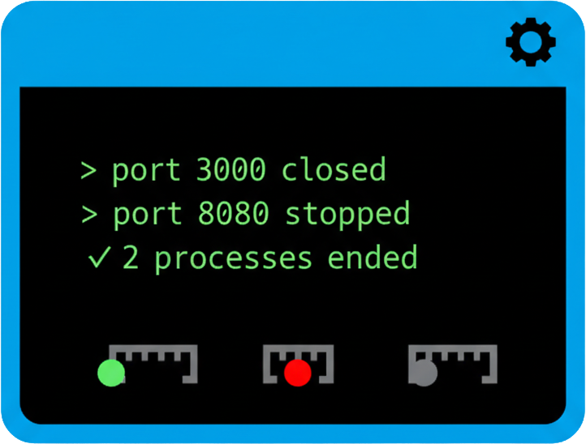

<p align="center">
  
</p>
<h1 align="center">Killport Benchmark Suite</h1>

Guida completa per testare e confrontare le performance tra **KillPort Advanced v2.0** e **killport (brew)**, con analisi statistiche avanzate e visualizzazioni grafiche.

## 📋 Indice

- [Installazione](#-installazione)
- [Uso Rapido](#-uso-rapido)
- [Configurazione Avanzata](#-configurazione-avanzata)
- [Test Eseguiti](#-test-eseguiti)
- [Visualizzazione Risultati](#-visualizzazione-risultati)
- [Formati di Export](#-formati-di-export)
- [Esempi Pratici](#-esempi-pratici)
- [Troubleshooting](#-troubleshooting)

------

## 🔧 Installazione

### Prerequisiti

```bash
# Python3 per simulazione porte (già presente su macOS)
python3 --version

# Opzionale: killport (brew) per confronti
brew install killport
```

### Verifica Setup

```bash
# Rendi eseguibili gli script
chmod +x benchmark_original.sh benchmark_visualizer_original.sh

# Verifica dipendenze (automatico)
./benchmark_original.sh
```

------

## ⚡ Uso Rapido

### Esecuzione Standard

```bash
# 1. Esegui benchmark completo
./benchmark_original.sh

# 2. Visualizza risultati con grafici
./benchmark_visualizer_original.sh
```

### Output Generati

Tutti i file vengono salvati nella cartella `benchmark/`:

```
benchmark/
├── benchmark_results_20241005_153045.txt    # Report testuale
├── benchmark_results_20241005_153045.csv    # Dati CSV
├── benchmark_charts_20241005_153045.txt     # Grafici ASCII
└── benchmark_report_20241005_153045.md      # Report Markdown
```

------

## ⚙️ Configurazione Avanzata

### Variabili Ambiente Disponibili

| Variabile     | Default                  | Descrizione                 | Uso                |
| ------------- | ------------------------ | --------------------------- | ------------------ |
| `RANGE_START` | 9100                     | Prima porta del range test  | `RANGE_START=8000` |
| `RANGE_END`   | 9120                     | Ultima porta del range test | `RANGE_END=8050`   |
| `ITERATIONS`  | 5 (test 1-2), 3 (test 3) | Numero ripetizioni          | Non modificabile*  |

*Le iterazioni sono hardcoded negli script per garantire risultati affidabili.

### Esempi Configurazione

```bash
# Range personalizzato (50 porte)
RANGE_START=8000 RANGE_END=8050 ./benchmark_original.sh

# Range ridotto per test veloci
RANGE_START=9000 RANGE_END=9005 ./benchmark_original.sh

# Range esteso per stress test
RANGE_START=7000 RANGE_END=7100 ./benchmark_original.sh
```

------

## 🧪 Test Eseguiti

### TEST 1: Kill Singola Porta

- **Obiettivo**: Performance su porta singola
- **Porte testate**: 9001
- **Iterazioni**: 5
- **Metriche**: Min, Max, Avg, StdDev

### TEST 2: Kill 3 Porte Simultanee

- **Obiettivo**: Efficienza batch processing
- **Porte testate**: 9001, 9002, 9003
- **Iterazioni**: 5
- **Metriche**: Avg, confronto

### TEST 3: Kill Range Porte

- **Obiettivo**: Gestione range estesi
- **Porte testate**: Configurabile (default: 9100-9120, 21 porte)
- **Iterazioni**: 3
- **Metriche**: Avg, confronto, successo/fallimento

### TEST 4: Lista Porte (Solo KillPort Advanced)

- **Obiettivo**: Performance discovery
- **Comando**: `killport --list`
- **Metriche**: Tempo esecuzione

### TEST 5: Statistiche Rete (Solo KillPort Advanced)

- **Obiettivo**: Performance analisi
- **Comando**: `killport --stats`
- **Metriche**: Tempo esecuzione

### Statistiche Calcolate

Per ogni test vengono calcolate:

- **Min** (ms): Tempo minimo esecuzione
- **Max** (ms): Tempo massimo esecuzione
- **Avg** (ms): Tempo medio esecuzione
- **StdDev (σ)** (ms): Deviazione standard (consistenza)

**Interpretazione StdDev:**

- σ < 5ms = Molto consistente 🟢
- σ 5-15ms = Accettabile 🟡
- σ > 15ms = Inconsistente 🔴

------

## 📊 Visualizzazione Risultati

### Esecuzione Visualizer

```bash
# Analizza ultimo benchmark automaticamente
./benchmark_visualizer_original.sh

# Il visualizer trova automaticamente l'ultimo file in benchmark/
```

### Output Visualizer

Il visualizer mostra:

1. **Legenda** - Spiegazione simboli e interpretazione
2. **Grafici ASCII** - Barre colorate per ogni test
3. **Statistiche dettagliate** - Min/Max/Avg/StdDev
4. **Confronti diretti** - Differenze percentuali
5. **Riepilogo finale** - Raccomandazioni

### Esempio Grafico

```
TEST 1: Kill Singola Porta
━━━━━━━━━━━━━━━━━━━━━━━━━━━━━━━━━━━━━━━━━━━━━━━
KillPort Advanced v2.0
  45ms [38-52] σ=±4ms
[████████████████████░░░░]

killport (brew)
  52ms [48-58] σ=±3ms
[████████████████████████]

⚡ brew è più veloce di 7ms (13%)
```

### Export Interattivo

Al termine della visualizzazione:

```bash
# Offre export grafici ASCII
Vuoi esportare i grafici ASCII in un file? (y/n): y
✓ Grafici esportati in: benchmark/benchmark_charts_TIMESTAMP.txt

# Offre export Markdown
Vuoi esportare in Markdown? (y/n): y
✓ Report Markdown esportato in: benchmark/benchmark_report_TIMESTAMP.md
```

------

## 📁 Formati di Export

### 1. Report TXT (Automatico)

Generato automaticamente da `benchmark_original.sh`:

```
KillPort Benchmark Results - Sun Oct 05 15:30:45 CEST 2024
==========================================

TEST 1: Singola Porta
  KillPort Advanced v2.0: avg=45ms, min=38ms, max=52ms, stddev=4ms
  killport (brew):        avg=52ms, min=48ms, max=58ms, stddev=3ms
  Differenza (avg):       -7ms (-13%)
```

### 2. CSV (Automatico)

Dati strutturati per analisi Excel/Python:

```csv
test_name,tool,min_ms,max_ms,avg_ms,stddev_ms,samples
Singola Porta,Advanced,38,52,45,4,5
Singola Porta,Brew,48,58,52,3,5
3 Porte Simultanee,Advanced,78,95,84,6,5
```

### 3. Grafici ASCII (On-demand)

Esportato dal visualizer su richiesta:

```
LEGENDA:
  █ = Barra performance
  [min-max] = Range valori
  σ=±N = Deviazione standard

INTERPRETAZIONE:
  < 30ms = Eccellente, 30-60ms = Buono, > 60ms = Lento
```

### 4. Report Markdown (On-demand)

Report completo formattato per GitHub/documentazione:

~~~markdown
# 🚀 KillPort Benchmark Report

**Generato:** Sun Oct 05 15:30:45 2024

## 📊 Legenda
...

## TEST 1: Kill Singola Porta
```text
KillPort Advanced  [████████████] [38-52] 45ms ±4
killport (brew)    [███████████████] [48-58] 52ms ±3
---

## 🎯 Esempi Pratici

### Scenario 1: Test Rapido

```bash
# Test veloce con range ridotto
RANGE_START=9000 RANGE_END=9005 ./benchmark_original.sh

# Visualizza risultati
./benchmark_visualizer_original.sh
~~~

### Scenario 2: Test Completo

```bash
# Test con range esteso (50 porte)
RANGE_START=8000 RANGE_END=8050 ./benchmark_original.sh

# Visualizza con export completo
./benchmark_visualizer_original.sh
# Rispondi 'y' a entrambi gli export
```

### Scenario 3: Confronto Periodico

```bash
#!/bin/bash
# Script per benchmark settimanale

echo "Benchmark settimanale - $(date)"

# Test standard
./benchmark_original.sh

# Visualizza senza export (automatico)
./benchmark_visualizer_original.sh <<< "n
n"

# Archivia risultati
mkdir -p benchmark/archive
cp benchmark/benchmark_results_*.txt benchmark/archive/
```

### Scenario 4: Debugging Performance

```bash
# Test con range minimo per debug
RANGE_START=9000 RANGE_END=9002 ./benchmark_original.sh

# Analizza output dettagliato
cat benchmark/benchmark_results_*.txt | tail -50
```

------

## 🔧 Troubleshooting

### Problema: "killport function not found"

```bash
# Soluzione: Ricarica configurazione
source ~/.zshrc

# Verifica installazione
type killport
# Output atteso: "killport is a shell function"
```

### Problema: "Poche porte aperte"

Messaggio: `Poche porte aperte (X < Y), salto iterazione`

```bash
# Causa: Sistema lento o porte già occupate

# Soluzione 1: Riduci range
RANGE_START=9000 RANGE_END=9005 ./benchmark_original.sh

# Soluzione 2: Chiudi applicazioni in background
# Verifica porte libere prima
lsof -i :9000-9120
```

### Problema: "Test falliti" nel visualizer

```bash
# Verifica quale test è fallito
grep "N/A" benchmark/benchmark_results_*.txt

# TEST 3 fallito: killport non supporta range
# Soluzione: Usa solo brew per confronti o skippa il test

# TEST 4/5 falliti: Opzioni non disponibili
# Normale se usi solo killport base
```

### Problema: Risultati inconsistenti (StdDev alto)

```bash
# Causa: Sistema sotto carico

# Soluzione: Chiudi applicazioni pesanti
# Verifica carico sistema
top -l 1 | grep "CPU usage"

# Re-esegui benchmark con sistema idle
./benchmark_original.sh
```

### Problema: File benchmark/ non trovato

```bash
# Il visualizer non trova i risultati

# Causa: Cartella benchmark non creata
# Soluzione automatica: benchmark_original.sh la crea

# Manualmente:
mkdir -p benchmark
./benchmark_original.sh
```

------

## 📈 Interpretazione Risultati

### Metriche Performance

**Tempi di esecuzione:**

- < 30ms = Eccellente

- 30-60ms = Buono

- 60-100ms = Accettabile

- > 100ms = Lento (verifica sistema)

**Consistenza (StdDev):**

- < 5ms = Molto consistente 🟢

- 5-15ms = Accettabile 🟡

- > 15ms = Inconsistente 🔴 (investigare)

### Confronto Tool

**Quando usare killport (brew):**

- Performance pure più importanti
- Ambiente minimal (no funzionalità extra)
- Compatibilità cross-platform

**Quando usare KillPort Advanced:**

- Serve monitoring (`--list`, `--stats`)
- Workflow completo
- Range e multiple porte
- Modalità avanzate

------

## 🚀 Best Practices

1. **Chiudi applicazioni pesanti** prima dei test
2. **Esegui su sistema idle** per risultati accurati
3. **Usa range consistenti** per confronti temporali
4. **Salva benchmark periodici** per tracking performance
5. **Archivia risultati importanti** in `benchmark/archive/`

------

## 📊 Struttura File Benchmark

```
benchmark/
├── benchmark_results_TIMESTAMP.txt    # Report principale (auto)
├── benchmark_results_TIMESTAMP.csv    # Dati CSV (auto)
├── benchmark_charts_TIMESTAMP.txt     # Grafici ASCII (on-demand)
├── benchmark_report_TIMESTAMP.md      # Report Markdown (on-demand)
└── archive/                           # Archiviazione manuale
    └── benchmark_results_*.txt
```

------

## 🔗 Riferimenti

- **Script principale**: `benchmark_original.sh`
- **Visualizer**: `benchmark_visualizer_original.sh`
- **Documentazione KillPort**: `README.md`
- **Range porte test**: 9000-9999 (evita conflitti con servizi comuni)

------

**Sviluppato con cura per macOS developers** 💙

*Per supporto: apri un issue su GitHub*