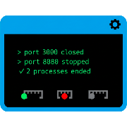

<div align="center"> 

# KillPort Advanced v2.0

**Complete suite for port management on macOS with advanced monitoring, multiple range support, and integrated benchmarking.**

[](README.md) [](README.it.md)

<div align="center"> <a href="https://github.com/AntonioDEM/killport-advanced/stargazers"></a> <a href="https://github.com/AntonioDEM/killport-advanced/network/members"></a> <a href="https://github.com/AntonioDEM/killport-advanced/pulls"></a> <a href="https://github.com/AntonioDEM/killport-advanced/issues"></a> <a href="https://github.com/AntonioDEM/killport-advanced/graphs/contributors"></a> <a href="https://github.com/AntonioDEM/Killport-Advanced/blob/main/benchmark/benchmark_report_20251005_214913.md"></a> </div> <br/>

  

   

</div>

------

## 📑 Table of Contents

- [Features](#-features)
- [Quick Installation](#-quick-installation)
- [Usage](#-usage)
- [Benchmark Suite](#-benchmark-suite)
- [Documentation](#-documentation)
- [Troubleshooting](#-troubleshooting)
- [Contributing](#-contributing)
- [License](#-license)

------

## ✨ Features

- 🎯 **Single port or multiple ranges** - Flexible port management
- 🔍 **Advanced monitoring** - Detailed visualization of listening processes
- ⚡ **Optimized performance** - Fast and efficient operations
- 📊 **Integrated benchmarking** - Complete performance testing suite
- 🐍 **Conda integration** - Native support for conda environments
- 🎨 **Colored output** - Clear and readable terminal interface
- 🛡️ **Robust error handling** - Complete checks and informative messages
- 📝 **Detailed logging** - Full operation tracking

------

## 🚀 Quick Installation

### Prerequisites

- macOS 10.15 or higher
- Zsh or Bash
- Python 3.10+
- [Conda/Miniconda](https://www.anaconda.com/docs/getting-started/miniconda/main) (optional but recommended)
- [Homebrew](https://brew.sh)
- [killport](https://formulae.brew.sh/formula/killport#default) project by [jkfran](https://github.com/jkfran/killport)

### Automatic Installation

```bash
# Clone the repository
git clone https://github.com/AntonioDEM/killport-advanced.git
cd killport-advanced

# Run the installation script
bash install_killport.sh

# Load the functions in your shell
source killport_zshrc_function.sh
```

### Manual Installation

If you prefer to install manually, add to your `~/.zshrc` or `~/.bashrc`:

```bash
# Add the path to functions
source /path/to/killport-advanced/killport_zshrc_function.sh
```

Then reload the configuration:

```bash
source ~/.zshrc  # for Zsh
# or
source ~/.bashrc # for Bash
```

------

## 💻 Usage

### Basic Commands

```bash
# Kill a single port
killport 8080

# Kill multiple ranges
killport 3000-3005 8080-8085

# Monitor listening ports
monitor_ports

# Show help
killport --help
```

### Advanced Examples

```bash
# Kill multiple specific ports
killport 3000 3001 8080 9000

# Combination of single ports and ranges
killport 3000 5000-5005 8080-8090

# Monitoring with filtering
monitor_ports | grep python
```

### Conda Integration

The tool automatically detects the active conda environment and manages it optimally:

```bash
# Activate environment
conda activate myenv

# Use killport normally
killport 8080

# The conda environment is preserved
```

------

## 📊 Benchmark Suite

The integrated benchmark suite allows you to test system performance.

### Running Benchmarks

```bash
# Go to the benchmark folder
cd benchmark

# Run the original benchmark
bash benchmark_original.sh

# View the results
bash benchmark_visualizer_original.sh
```

### Generated Reports

Benchmarks automatically generate:

- 📈 CSV files with detailed results
- 📊 Performance charts
- 📝 Complete markdown reports
- 📉 Comparative analysis

Results are saved in:

```
benchmark/
├── benchmark_results_YYYYMMDD_HHMMSS.csv
├── benchmark_results_YYYYMMDD_HHMMSS.txt
├── benchmark_charts_YYYYMMDD_HHMMSS.txt
└── benchmark_report_YYYYMMDD_HHMMSS.md
```

------

## 📚 Documentation

For detailed documentation, see:

- [BENCHMARK_GUIDE.md](benchmark/BENCHMARK_GUIDE.md) - Complete benchmark guide
- [CONTRIBUTING.md](CONTRIBUTING.md) - How to contribute to the project
- [LICENSE](LICENSE) - MIT License

------

## 🔧 Troubleshooting

### Port already in use

```bash
Error: Port 8080 is already in use
```

**Solution**: Use killport to terminate the process:

```bash
killport 8080
```

### Permission denied

```bash
Error: Permission denied
```

**Solution**: Some processes require elevated privileges:

```bash
sudo killport 8080
```

### Function not found

```bash
command not found: killport
```

**Solution**: Reload the shell functions:

```bash
source killport_zshrc_function.sh
```

### Conda Issues

If the conda environment is not detected correctly:

```bash
# Reinitialize conda
conda init zsh  # or bash

# Reload shell
source ~/.zshrc
```

------

## 🤝 Contributing

Contributions, issues, and feature requests are welcome!

See [CONTRIBUTING.md](CONTRIBUTING.md) for guidelines.

### How to Contribute

1. Fork the project
2. Create your feature branch (`git checkout -b feature/AmazingFeature`)
3. Commit your changes (`git commit -m 'Add some AmazingFeature'`)
4. Push to the branch (`git push origin feature/AmazingFeature`)
5. Open a Pull Request

------

## 📄 License

Distributed under the MIT License. See [LICENSE](LICENSE) for more information.

------

## 👨‍💻 Author

**Antonio Demarcus**

- GitHub: [@AntonioDEM](https://github.com/AntonioDEM)
- Repository: [killport-advanced](https://github.com/AntonioDEM/killport-advanced)

------

## 🙏 Acknowledgments

- Inspired by the [killport](https://github.com/jkfran/killport) project by jkfran
- Open source community for support
- All project contributors

------

<div align="center">

**⭐ If you find this project useful, leave a star! ⭐**

Made with ❤️ by [Antonio Demarcus](https://github.com/AntonioDEM)

</div>